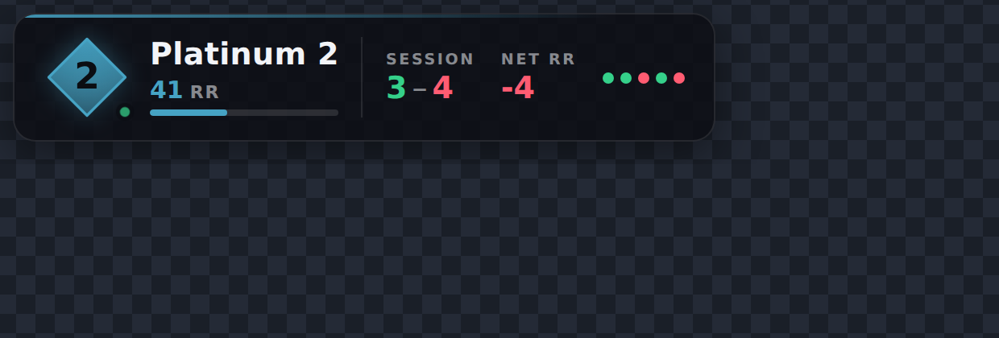

# VALORANT Rank Overlay

Live rank, RR and session record as an OBS browser source. Updates within a
couple of seconds of a ranked game ending — no manual refresh, no alt-tabbing.



## Requirements

- Windows (the Riot Client only writes its lockfile there)
- Node.js 18 or newer — <https://nodejs.org>
- VALORANT running, on the same PC as OBS

No `npm install` needed. The project has zero dependencies.

## Quick start

```bash
node src/index.js
```

Then in OBS:

1. **Sources → + → Browser**, name it `Rank`.
2. **URL**: `http://localhost:3040/overlay`
3. **Width** `600`, **Height** `160`.
4. Leave *Shutdown source when not visible* **unchecked** — the overlay keeps a
   live connection open, and shutting it down delays the first update.
5. Position it wherever you like. The background is transparent.

Open <http://localhost:3040/control> to check status, reset the session record,
and build a customised overlay URL with a live preview.

Start the agent before you start streaming and leave it running. It reconnects
on its own when VALORANT closes and reopens.

### Styling it without the game running

```bash
node src/index.js --mock
```

Serves fake data and "finishes" a ranked game every few seconds, so you can
position and size the overlay without queuing.

## How the fast updates work

Polling alone is laggy, so the agent uses two signals:

- **Local presence**, read from the Riot Client every 2 seconds. This is free
  and instant, and tells us when you go `INGAME → MENUS`.
- **Rank data**, polled every 30 seconds normally. When presence reports that a
  match just ended, it switches to every 3 seconds until Riot's match ID
  changes — that change *is* the new result landing.

So the overlay updates a beat after the match ends, without hammering Riot's
API while you sit in the lobby.

Win/loss is confirmed against the match detail rather than inferred from the
sign of the RR change, because at low ranks a loss can still net positive RR.
If the match detail is not available yet, the RR sign is used and corrected a
moment later.

## Customising

Add query parameters to the overlay URL, or use the control page to build one.

| Parameter | Values | Default | What it does |
|---|---|---|---|
| `layout` | `bar`, `stack`, `mini` | `bar` | Horizontal, vertical, or compact |
| `bg` | `card`, `none`, `solid` | `card` | `none` gives text only, no panel |
| `align` | `left`, `right` | `left` | Which edge the overlay grows from |
| `scale` | any number | `1` | `1.5` is 50% larger |
| `show` | `rank`, `record`, `delta`, `form` | all | Comma-separated blocks to display |
| `record` | `session`, `act` | `session` | Session record or whole-act record |
| `form` | `0`–`10` | `5` | How many recent results to show as dots |
| `accent` | `rank` or a hex colour | `rank` | Fixed accent instead of the rank colour |
| `hideOffline` | `0`, `1` | `0` | Hide the overlay entirely when VALORANT is closed |

Example — compact, right-aligned, rank and record only:

```
http://localhost:3040/overlay?layout=mini&align=right&show=rank,record
```

Everything else is plain CSS in `public/overlay.css`; edit it and refresh the
browser source.

### The session record

"Session" means ranked games played since the agent started. It survives a
restart, and resets automatically after 6 hours of downtime, so an overnight
gap starts you fresh. Reset it by hand any time from the control page.

## Configuration

Copy `config.example.json` to `config.json` to override defaults:

| Key | Default | Notes |
|---|---|---|
| `port` | `3040` | Also settable with the `PORT` environment variable |
| `shard` | auto | Force `na`, `eu`, `ap` or `kr` if detection is wrong |
| `idlePollMs` | `30000` | Rank poll rate when nothing is happening |
| `activePollMs` | `3000` | Poll rate in-game and just after a match |
| `sessionIdleResetMs` | `21600000` | Downtime before the session record resets |

## Troubleshooting

**"VALORANT is not running"** — start the game. The agent picks it up within a
few seconds; you do not need to restart it.

**Rank is right but RR looks stale** — RR lands when Riot processes the match,
which is occasionally a few seconds behind the end-of-game screen. The agent
keeps polling for three minutes after a match.

**Wrong region or 400 errors** — set `shard` in `config.json`.

**Port 3040 is in use** — set `port` in `config.json`, and update the OBS URL.

**No rank icon, just a coloured diamond** — the agent could not reach
`valorant-api.com` to download Riot's rank art. It retries, and the overlay
stays readable in the meantime.

**Nothing shows in OBS** — open the URL in a normal browser first. If it works
there, right-click the source and *Refresh*.

## How it gets the data

Riot's public API does not expose your own rank without an approved production
key. Instead, the agent uses the local Riot Client API: while VALORANT runs, the
client serves an authenticated HTTPS endpoint on `127.0.0.1`, with credentials
in a lockfile on disk. The agent reads that lockfile, obtains your session
tokens, and queries Riot's player-data endpoints for tier, RR and match history.

This is read-only — nothing is injected into the game and nothing is automated.
It is how rank trackers have worked for years, but the local API is
undocumented and unsupported by Riot, so it can change without warning.

Nothing leaves your machine except requests to Riot's own servers and
`valorant-api.com` for rank art. The server binds to `127.0.0.1`, so the
overlay is not reachable from your network.

## Layout

```
src/
  index.js          entry point: wires the tracker to the server
  config.js         defaults and config.json loading
  http.js           dependency-free request helper
  tracker.js        polling, session record, state shape
  mock.js           fake data source for --mock
  server.js         static files, /events (SSE), /api
  riot/
    localApi.js     lockfile, tokens, presence
    pd.js           rank, competitive updates, match outcomes
    tiers.js        tier names, colours, rank art
public/
  overlay.html/css/js   the overlay itself
  control.html          status, session reset, URL builder
```
